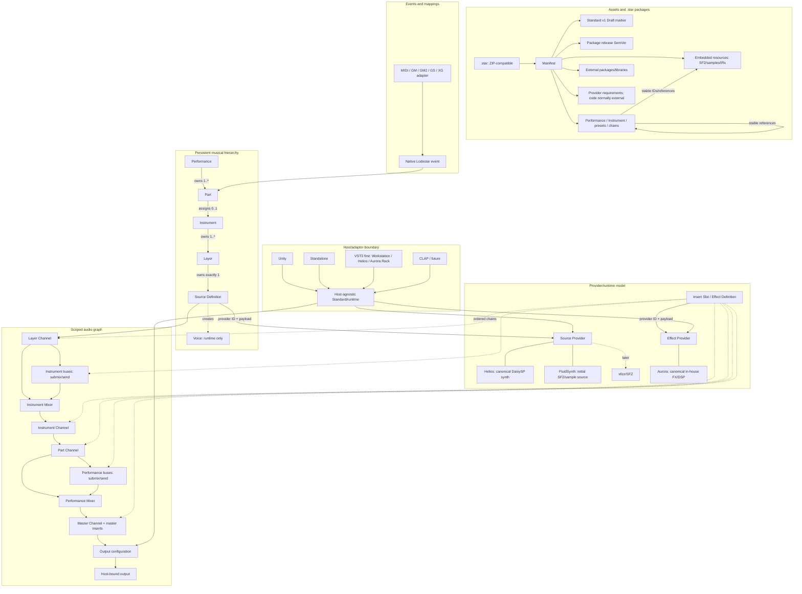
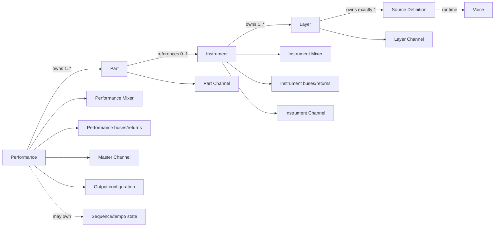
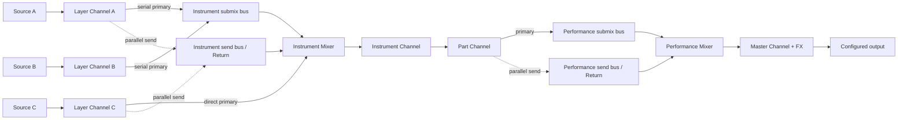
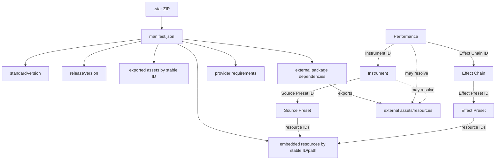
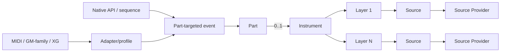
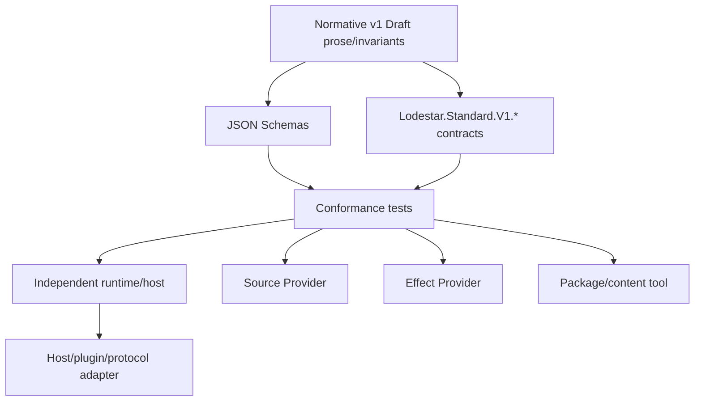

# Canonical Architecture Map

This is the canonical inventory and cross-domain map for Lodestar Standard v1 Draft. It consolidates settled architecture; detailed normative behavior remains in the linked specification documents. Diagrams are informative views of the normative inventory and do not add new semantics.

## Comprehensive system graph



## Object ownership



A Part has no Part Mixer and never owns several Instruments. Voice is provider-managed runtime state and is not serialized.

## Signal routing



Every Channel processes one signal; every Mixer combines signals. Bus-to-bus primary and send edges are valid only within the owning scope and when their combined graph is acyclic. Instrument nodes cannot address Performance buses directly; the Instrument Channel crosses through its Part Channel.

## Provider resolution

```mermaid
sequenceDiagram
  participant H as Host
  participant D as Source/Effect Definition
  participant R as Provider Registry
  participant P as Exact Provider
  H->>D: read providerId, role, payloadVersion, requirements
  H->>R: resolve exact stable ID and role
  R-->>H: descriptor, capabilities, supported payloads
  alt required and supported
    H->>P: prepare resolved resources off audio thread
    P-->>H: runtime Source or Effect
  else optional and unavailable
    H-->>H: declared silence/omit/bypass; diagnose degradation
  else required and unavailable
    H-->>H: reject affected asset before activation
  end
```

Sources and Effects use symmetric provider seams. Canonical providers are examples, not requirements. A provider may share a backend among Layers while preserving Layer ownership and observable isolation.

## Asset and package references



## Event flow



Synth engines and provider backends are never native event targets.

## Conformance layers



Adapters are informative integration surfaces. Schemas and contracts project the prose; disagreement is a Draft defect, not permission to reinterpret it.

## Normative concept inventory

| Concept | Owner/Scope | Cardinality | Persistent vs Runtime | Can Have Inserts | Can Have Sends | Can Route to Bus | Provider-backed? | Serialized? | Defined In Spec? | Schema? | Contract Type? |
|---|---|---:|---|---|---|---|---|---|---|---|---|
| Lodestar workstation/platform | Ecosystem/host | 1 concept | Runtime/product | N/A | N/A | N/A | Hosts providers | Product state is not canonical | [host boundaries](host-boundaries.md) | No | No |
| Performance | Top-level asset | 1; owns 1..* Parts | Both | Via Master | Via owned nodes | Owns Performance scope | No | Yes | [object model](object-model.md) | `performance.schema.json` | `IPerformanceDefinition` |
| Part | Performance | 1..* | Both | Via Part Channel | Via Part Channel | Performance buses | No | Yes | [object model](object-model.md) | `performance.schema.json` | `IPartDefinition` |
| Instrument assignment | Part | 0..1 | Persistent reference | N/A | N/A | N/A | No | Yes | [object model](object-model.md) | `performance.schema.json` | `InstrumentId` |
| Instrument | Reusable asset | 0..1 per Part; owns 1..* Layers | Both | Via Instrument Channel | Via Instrument Channel | Crosses through Part | No | Yes | [object model](object-model.md) | `instrument.schema.json` | `IInstrumentDefinition` |
| Layer | Instrument | 1..* | Both | Via Layer Channel | Yes | Instrument buses | No | Yes | [object model](object-model.md) | `instrument.schema.json` | `ILayerDefinition` |
| Source Definition | Layer | Exactly 1 | Persistent | No | No | Via Layer Channel | Source Provider | Yes | [sources](sources.md) | `instrument.schema.json` | `ISourceDefinition` |
| Voice | Provider runtime | 0..* active | Runtime only | No | No | No | Provider-managed | No | [sources](sources.md) | No | No persistent type |
| Layer Channel | Layer/Instrument scope | 1 per Layer | Both | Yes | Yes | Instrument buses | Effect slots | Yes | [channels](channels.md) | `routing.schema.json` | `IChannelDefinition` |
| Instrument Mixer | Instrument | Exactly 1 | Both | No | No | Owns Instrument buses | No | Yes | [mixers](mixers.md) | `routing.schema.json` | `IMixerDefinition` |
| Instrument bus | Instrument Mixer | 0..* | Both | Yes | Yes | Same-scope buses | Effect slots | Yes | [buses](buses.md) | `routing.schema.json` | `IBusDefinition` |
| Instrument Channel | Instrument | Exactly 1 | Both | Yes | Yes | Performance buses after Part | Effect slots | Yes | [channels](channels.md) | `instrument.schema.json` | `InstrumentChannel` |
| Part Channel | Part/Performance scope | Exactly 1 | Both | Yes | Yes | Performance buses | Effect slots | Yes | [channels](channels.md) | `performance.schema.json` | `IPartDefinition.Channel` |
| Performance Mixer | Performance | Exactly 1 | Both | No | No | Owns Performance buses | No | Yes | [mixers](mixers.md) | `routing.schema.json` | `IMixerDefinition` |
| Performance bus | Performance Mixer | 0..* | Both | Yes | Yes | Same-scope buses | Effect slots | Yes | [buses](buses.md) | `routing.schema.json` | `IBusDefinition` |
| Submix bus | One mixer scope | 0..* | Both | Yes | Yes | Same-scope, acyclic | Effect slots | Yes | [routing](routing.md) | `routing.schema.json` | `BusKind.Submix` |
| Send bus | One mixer scope | 0..* | Both | Yes | Yes | Same-scope, acyclic | Effect slots | Yes | [routing](routing.md) | `routing.schema.json` | `BusKind.Send` |
| Return Channel | Send bus | Exactly 1 when separate | Both | Yes | Yes | Same-scope | Effect slots | Yes | [buses](buses.md) | Bus `channel` | `ChannelKind.BusReturn` |
| Master Channel | Performance | Exactly 1 | Both | Yes; ordered master chain | No portable downstream send required | No | Effect slots | Yes | [channels](channels.md) | `performance.schema.json` | `MasterChannel` |
| Primary route | Channel/bus output | Exactly 1 | Persistent graph | N/A | N/A | Same-scope where allowed | No | Yes | [routing](routing.md) | `routing.schema.json` | `IRouteDestination` |
| Send | Channel/bus | 0..* | Both | N/A | N/A | Same-scope send bus | No | Yes | [routing](routing.md) | `routing.schema.json` | `ISendDefinition` |
| Insert Slot / Effect Definition | Eligible channel | 0..* ordered; 1 effect each | Both | Contains effect | No | No | Effect Provider | Yes | [effects](effects.md) | routing/effect-chain | `IInsertSlotDefinition`, `IEffectDefinition` |
| Source Provider | Host registry | 1 exact per Source | Runtime code + persistent ID/payload | No | No | No | Is provider | ID/payload | [providers](providers.md) | Source fields | `ISourceProvider`, `IProviderDescriptor` |
| Effect Provider | Host registry | 1 exact per Effect | Runtime code + persistent ID/payload | No | No | No | Is provider | ID/payload | [providers](providers.md) | Effect fields | `IEffectProvider`, `IProviderDescriptor` |
| Provider capabilities | Provider/host | 0..* | Runtime discovery | N/A | N/A | N/A | Reported | Requirements may be | [providers](providers.md) | Manifest requirements | `Capabilities` |
| Helios / FluidSynth / sfizz | Ecosystem | Optional | Runtime providers | No | No | Via Layer Channel | Source Providers | Payload only | [sources](sources.md) | No vendor schema | External |
| Aurora | Ecosystem | Optional | Runtime provider | Through slots | No | No | Effect Provider | Payload only | [effects](effects.md) | No vendor schema | External |
| Native event | Performance/API | 0..*; targets 1 Part | Runtime delivery or persistent Sequence | No | No | No | Delivered to sources | Yes in Sequence | [events](events.md) | `performance.schema.json` | `ILodestarEvent`, `ISequencedEventDefinition` |
| MIDI/GM/GM2/GS/XG | Host adapter | 0..* | Runtime/informative | No | No | No | Mapping only | Not native | [events](events.md) | No | No core type |
| Source/Effect Preset | Package/library | 0..* | Persistent asset | No | No | No | Exactly 1 matching provider | Yes | [assets](assets.md) | preset schemas | Preset definitions |
| Effect Chain | Package/library | 0..* slots | Persistent asset | Ordered slots | No | No | Many providers allowed | Yes | [effects](effects.md) | `effect-chain.schema.json` | `IEffectChainDefinition` |
| Resource | Package/library | 0..* | Persistent non-code data | No | No | No | Provider-consumed | Yes | [assets](assets.md) | `manifest.schema.json` | `IPackageResourceEntry` |
| Stable logical ID/reference | Declared resolution scope | 1/object; 0..* refs | Persistent | N/A | N/A | N/A | Includes provider IDs | Yes | [assets](assets.md) | All asset schemas | `LodestarId`, `ProviderId` |
| `.star` package | Distribution | 1 manifest | Persistent ZIP | No | No | No | Declares requirements | Yes | [packages](packages.md) | `star-package.schema.json` | `StarPackage`, `IPackageManifest` |
| Package dependency/library | Manifest | 0..* | Persistent + runtime resolution | No | No | No | No | Yes | [packages](packages.md) | `manifest.schema.json` | `IPackageDependency` |
| Output configuration | Performance | 1 main; 0..* auxiliaries | Persistent logical + runtime binding | No | No | Endpoint, not Bus | No | Yes | [host boundaries](host-boundaries.md) | `performance.schema.json` | `IOutputConfigurationDefinition` |
| Sequence/tempo state | Performance | 0..1 | Both | No | No | No | No | Yes when present | [events](events.md) | `performance.schema.json` | `ISequenceTempoStateDefinition` |
| Host/plugin adapter | Outside core | 0..* | Runtime/product | N/A | N/A | Maps outputs | Hosts providers | Projection only | [host boundaries](host-boundaries.md) | No | No normative ABI |
| DSP limits/profile | Host/provider | Per prepared context | Runtime discovery | N/A | N/A | N/A | Reported | As applicable | [realtime](realtime.md) | No hard-limit schema | `Capabilities` |
| Standard version | Standard/document | Exactly 1/document | Persistent marker | N/A | N/A | N/A | No | Yes | [serialization](serialization.md) | All documents | namespace/constant |
| Package release SemVer | Package | Exactly 1 | Persistent metadata | N/A | N/A | N/A | No | Yes | [packages](packages.md) | `manifest.schema.json` | `ReleaseVersion` |
