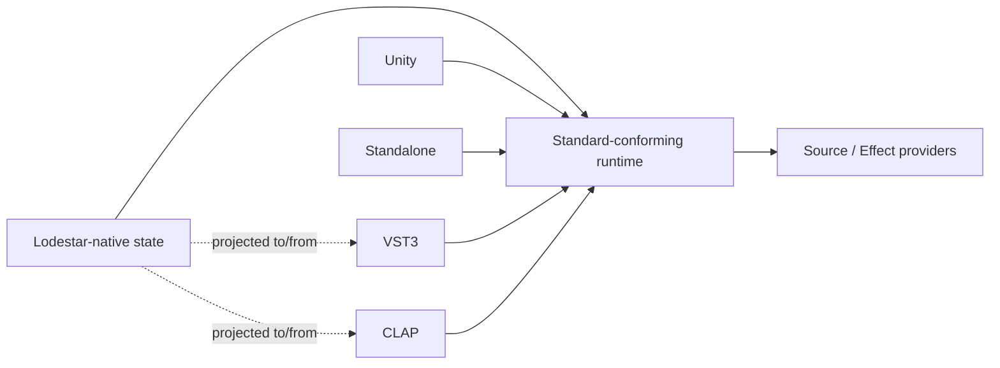

# Host and Adapter Boundaries

The core Standard and provider model are host-agnostic. A host owns lifecycle, preparation, graph execution, endpoint binding, persistence orchestration, diagnostics, and provider discovery while preserving portable Lodestar semantics.

Plugin or host state MUST be a projection of Lodestar-native state when it represents portable content. A VST3/CLAP parameter, Unity object, editor document, or platform blob MUST NOT become the canonical Performance, Instrument, preset, Effect Chain, or route graph. Host-only state MAY coexist when namespaced and when losing it does not change portable meaning.

## Informative product targets

VST3 is the first planned adapter, followed by CLAP. Planned products are Lodestar Workstation (multitimbral Performance host), Helios Synth, and Aurora FX Rack. FluidSynth is initially an internal Source Provider, not a required standalone plugin. These plans are informative; conformance requires none of them.

## Protocol adapters and shared backends

MIDI is one possible external input/control adapter. A host MAY map MIDI messages and conventions into Lodestar events, Part IDs, controls, and provider payloads. This does not imply GM, GS, XG, or other legacy-profile compatibility. An adapter MUST NOT introduce a second native hierarchy, make a synth engine an event target, force a Part count, or transfer ownership to a shared backend.

A shared backend such as FluidSynth MAY serve several Layer runtime instances. That optimization does not make backend MIDI channels or audio groups the owner of Parts, Instruments, Layers, Sources, or Channels.

## Outputs and independence

A Performance owns one logical main stereo output. The host maps that portable output to a device, file, DAW bus, plugin output, or other endpoint. A VST3 or other host MAY provide additional outputs and retain their routing in host/plugin state, but that state is not portable Lodestar content. The Master Channel remains the final portable processing stage before the main output; endpoint details are not canonical Lodestar state.

Unity and other integrations may be closed-source or commercial but MUST NOT be necessary to implement the Standard independently. Documentation is CC BY 4.0; contracts, schemas, tests, and executable/reference examples are Apache-2.0 as described by the repository licenses.
